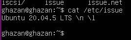
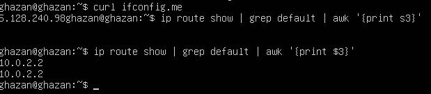
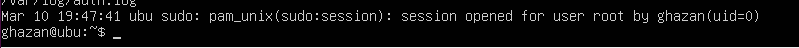

## Part 1. Installation of the OS

<figcaption align = "center"><b>Checking the version</b></figcaption>



## Part 2. Creating a user

```bash
sudo useradd endadeir
sudo usermod -g adm endadeir
```


<figcaption align = "center"><b>cat /etc/passwd output</b></figcaption>


## Part 3. Setting up the OS network

<figcaption align = "center"><b>Change hostname</b></figcaption>

```bash
hostnamectl set-hostname user-1
```


```bash
timedatectl set-timezone Asia/Novosibirsk
```

<figcaption align = "center"><b>Change timezone</b></figcaption>


<figcaption align = "center"><b>lo</b></figcaption>
The "lo" interface, also known as the loopback interface, is a virtual network interface present in almost all modern operating systems, including Linux, Unix, and Windows. The primary purpose of the loopback interface is to allow a device to communicate with itself.<br><br>

When a program on a device wants to communicate with another program on the same device, it sends the data to the loopback interface. The loopback interface then routes the data back to the same device, where the receiving program can access it. This is done entirely within the device itself, without any data being sent over an external network.<br><br>

The loopback interface is also used by network diagnostic tools, such as ping and traceroute, to test whether the device's network stack is working correctly. By sending packets to the loopback interface and then receiving them, these tools can test whether the network stack is correctly handling incoming and outgoing packets.<br><br>

In summary, the loopback interface is an essential part of a device's network infrastructure, enabling it to communicate with itself and helping to diagnose network issues.


<figcaption align = "center"><b>Get the ip addres</b></figcaption>



DHCP stands for Dynamic Host Configuration Protocol. It is a network protocol that is used to automatically assign IP addresses and other network configuration information to devices on a network. DHCP simplifies network administration because it allows devices to be added to a network without the need for an administrator to manually assign unique IP addresses to each device. DHCP also allows for the efficient use of IP addresses, as it ensures that each device is only assigned an IP address for the duration of its connection to the network, and the IP address can be recycled when the device disconnects.+

<figcaption align = "center"><b>Changing the yaml file and confirming changes</b></figcaption>

```bash
sudo nano /etc/netplan/00-installer-config.yaml
```


<figcaption align = "center"><b>After reboot</b></figcaption>


## Part 4. OS Update

```bash
sudo apt update
```


```bash
sudo list --upgradable
sudo apt upgrade
```


## Part 5. Using the sudo command
`sudo` is a command-line program that allows trusted users to execute commands as root or another user.

```bash
usermod -aG sudo endadeir
```


## Part 6. Installing and configuring the time service

<figcaption align = "center"><b>Enabling synchronization</b></figcaption>


## Part 7. Installing and using text editors

#### 1. Installing
```bash
sudo apt install vim
sudo apt install nano
sudo apt install mcedit
```


#### 2. Creating and working with files
```bash
vim test_vim.txt
```

<figcaption align = "center"><b>vim</b></figcaption>


:wq - to quit and save changes

<figcaption align = "center"><b>nano</b></figcaption>


ctrl + x + y + return - to quit and save changes

```bash
mcedit test_mcedit.txt
```

<figcaption align = "center"><b>mcedit</b></figcaption>


F1 + return + F10 - to quit and save changes

#### 3. Creating and working with files
<figcaption align = "center"><b>vim</b></figcaption>


:q! - to exit without saving

<figcaption align = "center"><b>nano</b></figcaption>


ctrl + x + n - to exit without saving

<figcaption align = "center"><b>mcedit</b></figcaption>


F10 + chose NO + return

#### 4. creating and working with files

<figcaption align = "center"><b>vim search</b></figcaption>


/ - to find in vim

<figcaption align = "center"><b>nano search</b></figcaption>


ctrl + w - to find in nano
ctrl + \ - to replase in nano

<figcaption align = "center"><b>mcedit</b></figcaption>


F7 - to search
F4 - to replase

## Part 8. Installing and basic setup of the SSHD service

`sudo apt-get install openssh-server`
`sudo systemctl enable ssh` - to enable ssh on boot 

<figcaption align = "center"><b>ssh status</b></figcaption>


<figcaption align = "center"><b>ufw status</b></figcaption>

```bash
sudo ufw allow ssh  
sudo ufw enable  
sudo ufw status
```


<figcaption align = "center"><b>Changing port 22 to port 2022</b></figcaption>

```bash
sudo nano /etc/ssh/sshd_config
```


<figcaption align = "center"><b>netstat -tan output</b></figcaption>

```bash
service ssh restart
```


netstat:
* `-t`  (--tcp) tcp protocol output
* `-a` (--all) Show both listening and non-listening sockets
* `-n` (--numeric) Show numerical addresses instead of trying to determine symbolic host, port or user names

Proto - the protocol (tcp, udp, raw) used by the socket.

Recv-Q - the count of bytes not copied by the user program connected to this socket.

Send-Q - the count of bytes not acknowledged by the remote host.

Local Address - Address and port number of the local end of the socket. Unless the --numeric (-n) option is specified, the socket address is resolved to its canonical host name (FQDN), and the port number is translated into the corresponding service name.

Foreign Address - address and port number of the remote end of the socket. Analogous to "Local Address."

State - the state of the socket. Since there are no states in raw mode and usually no states used in UDP, this column may be left blank.

## Part 9. Installing and using the top, htop utilities

The top program in Linux is a command-line utility that provides real-time information about the processes and system resource usage on a Linux system.<br>
This will display a continuously updating list of processes and their resource usage, sorted by default by the percentage of CPU usage. The information provided by top includes the process ID, user, CPU usage, memory usage, and more.

You can use various keyboard commands to interact with the top program and customize its output. Some commonly used commands include:

*    q: quit top
*    k: kill a process
*    u: filter the list by a specific user
*    r: renice a process (change its priority)
*    1: show individual CPU usage (useful for multi-core systems)
*    h: display the help screen with all the available commands


<figcaption align = "center"><b>top utility</b></figcaption>
 uptime and number of authorised users: 

 total system load: 

 total number of processes: 

 CPU Load - shows CPU state percentages based on the interval since the last refresh.
	
Memory Load:
This portion consists of two lines which may express values in kibibytes (KiB)

<figcaption align = "center"><b>htop utility</b></figcaption>

To sort, press `F6` and select the desired parameter

<figcaption align = "center"><b>sorted by PID</b></figcaption>


<figcaption align = "center"><b>sorted by %CPU</b></figcaption>


<figcaption align = "center"><b>sorted by %MEM</b></figcaption>


<figcaption align = "center"><b>sorted by TIME</b></figcaption>


<figcaption align = "center"><b>Filtered for sshd process</b></figcaption>

 `F4` to filter
 


<figcaption align = "center"><b>Searching</b></figcaption>

 To search, press `F3`
 


<figcaption align = "center"><b>Add hostname and clock</b></figcaption>

 press `F2`, add Hostname and Clock to Right column
 


## Part 10. Using the fdisk utility

The `fdisk -l` command is a Linux command used to list the available disks and their partitions on your system. The output of this command shows you the details of all the disk devices and their partitions that are attached to your system.


## Part 11. Using the df utility

<figcaption align = "center"><b>df</b></figcaption>


*  partition size : 8408452K (~8.4G)
*  space used : 4279036K (~4.3G)
*  space free: 3680700K (~3.97G)
*  percentage used : 54%

<figcaption align = "center"><b>df -Th</b></figcaption>


 `-T` - print file system type
 `-h` - print sizes in powers of 1024 (human-readable)
*   partition size : 8.1G
*   space used : 4.1G
*   space free: 3.6G
*   percentage used : 54%
*   file system type : ext4

## Part 12. Using the du utility

<figcaption align = "center"><b>/home /var/log and /var</b></figcaption>


<figcaption align = "center"><b>human readable sizes</b></figcaption>


<figcaption align = "center"><b>all contents in /var/log</b></figcaption>


## Part 13. Installing and using the ncdu utility

<figcaption align = "center"><b>/home</b></figcaption>

```bash
sudo apt-get install ncdu
ncdu /home
```


<figcaption align = "center"><b>/var</b></figcaption>

```
ncdu /var
```


<figcaption align = "center"><b>/var/log</b></figcaption>

```
ncdu /var/log
```


## Part 14. Working with system logs

<figcaption align = "center"><b>/var/log/dmesg</b></figcaption>


<figcaption align = "center"><b>/var/log/syslog</b></figcaption>


<figcaption align = "center"><b>/var/log/auth.log</b></figcaption>


<figcaption align = "center"><b>Last login</b></figcaption>



<figcaption align = "center"><b>SSHd restart logs</b></figcaption>

```bash
sudo systemctl restart ssh.service
```


## Part 15. Using the CRON job scheduler

```bash
crontab -e
crontab -l
```


<figcaption align = "center"><b>/var/log/syslog</b></figcaption>


